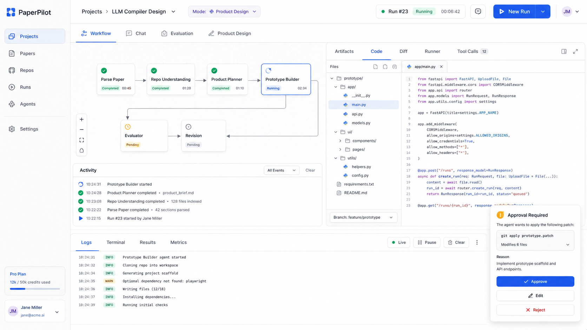

# PaperPilot UI Workbench 修改方案：基于目标界面对当前代码的文件级改造计划

## 0. 目标

你现在的目标不是继续加概念，而是把现有 `frontend/ + backend/ + graphs/ + runtime/` 真正打通成一个可用、好看、可信的 Research Agent IDE。

本方案基于当前代码审查和目标 UI 图，重点回答：

```text
1. 当前代码和目标 UI 差在哪里？
2. 当前每个 UI 区域是否真的可用？
3. 应该改哪些文件？
4. 哪些地方需要后端 API 配合？
5. 如何按阶段改，避免一次性重构崩掉？
```

目标 UI 图：



如果在 ChatGPT 沙盒中查看，图片文件为：

```text
paperpilot_target_ui_workbench.png
```

---

## 1. 当前代码状态简评

当前仓库已经有明显进步：

```text
frontend/components/layout/
  center-workspace.tsx
  project-sidebar.tsx
  top-bar.tsx

frontend/components/inspector/
  artifacts-panel.tsx
  code-panel.tsx
  diff-panel.tsx
  runner-panel.tsx
  tool-call-panel.tsx
  logs-panel.tsx
  preview-panel.tsx

frontend/components/code/
  code-editor.tsx
  diff-viewer.tsx
  file-tree.tsx

frontend/components/approval/
  action-approval-drawer.tsx

backend/
  runs/actions/artifacts/files/patches/checks/commands routers
  run_service
  event_service
  graph_service
  patch_service
  file_service
```

但和目标 UI 相比，目前仍然存在几个核心问题：

```text
1. 左侧 ProjectSidebar 仍然混合了项目导航、run 表单、LLM 设置，不像目标 UI 的清爽导航栏。
2. TopBar 信息不够丰富，缺少 breadcrumb、run id、运行时长、New Run 按钮和用户区。
3. CenterWorkspace 仍然混合 co-planning、chat、graph、timeline、approval；目标 UI 应该以 Workflow + Activity 为主。
4. WorkflowGraph 虽然有 API graph，但 graph_service 仍部分靠 message 关键词推断 node，不够稳定。
5. Inspector 的 Code/Diff/Runner/Tool Calls 组件有雏形，但很多数据仍来自 mock 或半真实状态。
6. Action Approval Drawer 有组件，但前端仍没有稳定绑定真实 pending actions。
7. Files API 和 Patch API 还没有严格 run-scoped，离真正项目工作区还有距离。
8. Patch apply 缺少 approval + syntax check + event 记录，Patch-first 闭环没完成。
9. Productize evaluation issues 组件有了，但仍有 MOCK_ISSUES，没有完全接真实 evaluator output。
```

---

## 2. 目标 UI 与当前代码差距

### 2.1 左侧 Sidebar

目标 UI 左侧：

```text
PaperPilot Logo
Projects
Papers
Repos
Runs
Agents
Settings

底部：
  Plan / credits
  User profile
```

当前 `project-sidebar.tsx`：

```text
Workspace title
Search
Mode selector
Project input
PDF upload
Repo input
Hardware
Task
LLM config
Run Agents button
Nav groups
```

问题：

```text
当前 sidebar 是“输入表单 + 配置 + 导航”的混合体。
目标 UI 里的 sidebar 应该只做导航，输入和新建 run 应该放到 New Run Drawer / Modal。
```

建议：

```text
1. `ProjectSidebar` 只保留导航。
2. 新建 `RunIntakeDrawer` 存放 PDF upload、repo、hardware、task、LLM config。
3. 点击 TopBar 的 `New Run` 打开 drawer。
4. `ProjectSidebar` 的 Projects / Runs 数据从 backend 获取，而不是静态 navItems。
```

---

### 2.2 TopBar

目标 UI 顶部：

```text
Projects > LLM Compiler Design
Mode: Product Design
Run #23
Running
Timer
Message icon
New Run button
Avatar
```

当前 `top-bar.tsx`：

```text
PaperPilot Research Agent IDE
Project / Mode / Model
Summary
StatusPill
```

问题：

```text
当前 TopBar 更像标题栏，不像产品级控制栏。
```

建议：

```text
1. 增加 breadcrumb。
2. 增加 mode selector。
3. 增加 run id/status/time。
4. 增加 New Run 按钮。
5. 增加 profile/avatar。
```

建议类型：

```ts
export type TopBarRunState = {
  projectName: string;
  runId?: string;
  mode: "reproduce" | "productize";
  status: "pending" | "running" | "success" | "failed" | "waiting_review" | "revised";
  elapsed?: string;
  model?: string;
};
```

建议组件骨架：

```tsx
export function TopBar({ run, onNewRun }: { run: TopBarRunState; onNewRun: () => void }) {
  return (
    <header className="top-bar">
      <div className="breadcrumbs">
        <span>Projects</span>
        <span>/</span>
        <strong>{run.projectName}</strong>
      </div>

      <select value={run.mode} className="mode-select">
        <option value="reproduce">Reproduce</option>
        <option value="productize">Product Design</option>
      </select>

      <div className="run-status">
        <span>{run.runId ?? "No Run"}</span>
        <StatusPill status={run.status} />
        <span>{run.elapsed ?? "00:00:00"}</span>
      </div>

      <button className="primary" onClick={onNewRun}>New Run</button>
      <div className="avatar">JM</div>
    </header>
  );
}
```

---

### 2.3 中间 Workflow 区域

目标 UI 中间：

```text
Workflow / Chat / Evaluation / Product Design tabs
Workflow canvas
Activity timeline
```

当前 `center-workspace.tsx`：

```text
Run header
Editable plan
Agent chat
Workflow graph
Event stream
Approval
```

问题：

```text
1. 信息太散，Workflow 不是绝对主角。
2. Approval 不应该塞在 center，应该是右下浮动 drawer。
3. Plan / Chat / Workflow / Evaluation 应该通过 tabs 组织。
4. Activity timeline 应该在 Workflow 下方，而不是和 chat/plan 混杂。
```

建议改成：

```text
CenterWorkspace
  ├── WorkbenchTabs
  │   ├── Workflow
  │   ├── Chat
  │   ├── Evaluation
  │   └── Product Design
  ├── WorkflowCanvas
  └── ActivityPanel
```

建议组件结构：

```text
frontend/components/workbench/
  workbench-tabs.tsx
  workflow-page.tsx
  chat-page.tsx
  evaluation-page.tsx
  product-design-page.tsx
  activity-panel.tsx
```

建议 `CenterWorkspace` 只做布局：

```tsx
export function CenterWorkspace({ activeTab, onTabChange, graphNodes, events }: Props) {
  return (
    <main className="center-workspace">
      <WorkbenchTabs activeTab={activeTab} onTabChange={onTabChange} />

      {activeTab === "workflow" && (
        <>
          <WorkflowGraph nodes={graphNodes} />
          <ActivityPanel events={events} />
        </>
      )}

      {activeTab === "chat" && <AgentChat />}
      {activeTab === "evaluation" && <EvaluationPage />}
      {activeTab === "product" && <ProductDesignPage />}
    </main>
  );
}
```

---

### 2.4 WorkflowGraph

目标 UI：

```text
节点卡片清楚：
  Parse Paper
  Repo Understanding
  Product Planner
  Prototype Builder
  Evaluator
  Revision

节点状态：
  Completed / Running / Pending
```

当前问题：

```text
1. `workflow-graph.tsx` 只有基础 graph wrapper。
2. `graph_service.py` 仍部分依赖 message 关键词推断 node。
3. 前端 graph node detail 不够强。
```

后端需要改：

```text
所有 graph node 直接 emit structured event：
  event_type: node_started / node_finished / node_failed
  graph: reproduce / productize
  node: exact_node_id
  agent: agent_name
```

建议事件结构：

```ts
export type AgentEvent = {
  event_id: string;
  run_id: string;
  graph: "reproduce" | "productize";
  node: string;
  agent: string;
  event_type:
    | "node_started"
    | "node_finished"
    | "node_failed"
    | "tool_call"
    | "tool_result"
    | "artifact_created"
    | "human_review_required"
    | "evaluation_issue"
    | "revision_started";
  status: "pending" | "running" | "success" | "failed" | "waiting_review" | "revised";
  message: string;
  payload: Record<string, unknown>;
  created_at: string;
};
```

前端 graph node：

```tsx
export function WorkflowNodeCard({ data }: { data: GraphNodeData }) {
  return (
    <div className={`workflow-node ${data.status}`}>
      <div className="node-icon">{statusIcon(data.status)}</div>
      <strong>{data.label}</strong>
      <StatusPill status={data.status} />
      <small>{data.duration ?? "--"}</small>
    </div>
  );
}
```

---

### 2.5 右侧 Inspector / Code Workbench

目标 UI 右侧：

```text
Tabs:
  Artifacts
  Code
  Diff
  Runner
  Tool Calls

Code:
  File tree
  Monaco editor
  Approval card floating
```

当前进展：

```text
CodePanel 已经使用 FileTree + CodeEditor。
CodeEditor 已经引入 @monaco-editor/react。
DiffViewer 已经引入 react-diff-viewer-continued。
ActionApprovalDrawer 已存在。
```

主要问题：

```text
1. InspectorPanel 仍是上层总控，很多数据还从 mock-data 来。
2. CodePanel 的 file tree 数据来自 apiFiles 或 fileTabs fallback。
3. DiffPanel 的 patchFile/oldCode/newCode 仍依赖上层传入 mock patchPreview。
4. RunnerPanel 类型仍是 ApprovalRequest / RunnerReview from mock-data。
5. ToolCallPanel 类型仍是 ToolCall from mock-data。
```

建议改法：

```text
1. InspectorPanel 不再直接 import mock-data。
2. 每个 panel 接收 API-backed data。
3. ToolCalls 从 events 过滤出来。
4. Runner 从 actions + command results 读取。
5. Diff 从 patches API 读取。
```

新数据流：

```text
/api/artifacts/{run_id}            → ArtifactsPanel
/api/files/{run_id}                → CodePanel
/api/files/{run_id}/content        → CodeEditor
/api/patches/{run_id}              → DiffPanel
/api/runs/{run_id}/actions         → RunnerPanel / ApprovalDrawer
/api/runs/{run_id}/events          → ToolCallPanel / LogsPanel / ActivityPanel
```

---

### 2.6 底部 Logs / Terminal / Results / Metrics

目标 UI 底部：

```text
Logs / Terminal / Results / Metrics
Live / Pause / Clear
```

当前代码：

```text
LogsPanel 存在，但整体仍在 Inspector 中，不像目标图的 bottom dock。
```

建议新增：

```text
components/layout/bottom-dock.tsx
components/logs/logs-panel.tsx
components/logs/terminal-panel.tsx
components/logs/results-panel.tsx
components/logs/metrics-panel.tsx
```

第一版可以不做真实 terminal，只显示 runner stdout/stderr：

```tsx
export function BottomDock({ events, commandResults }: Props) {
  return (
    <section className="bottom-dock">
      <Tabs defaultValue="logs">
        <TabsList>
          <TabsTrigger value="logs">Logs</TabsTrigger>
          <TabsTrigger value="terminal">Terminal</TabsTrigger>
          <TabsTrigger value="results">Results</TabsTrigger>
          <TabsTrigger value="metrics">Metrics</TabsTrigger>
        </TabsList>
        <TabsContent value="logs"><LogsPanel events={events} /></TabsContent>
        <TabsContent value="terminal"><TerminalPanel results={commandResults} /></TabsContent>
      </Tabs>
    </section>
  );
}
```

---

### 2.7 浮动 Approval Card

目标 UI 右下角：

```text
Approval Required
git apply prototype.patch
Approve / Edit / Reject
```

当前 `ActionApprovalDrawer` 已经有，但需要真实 pending actions 支撑。

需要补后端 API：

```python
# backend/routers/runs.py or backend/routers/actions.py
@router.get("/runs/{run_id}/actions", response_model=list[ActionRequest])
def list_run_actions(run_id: str) -> list[ActionRequest]:
    if run_service.get_run(run_id) is None:
        raise HTTPException(status_code=404, detail="Run not found")
    return run_service.list_actions(run_id)
```

前端 API：

```ts
export async function fetchRunActions(runId: string): Promise<ApiAction[]> {
  const response = await fetch(`${API_BASE}/api/runs/${runId}/actions`, {
    cache: "no-store",
  });
  if (!response.ok) {
    throw new Error(`Run actions API returned ${response.status}`);
  }
  return response.json();
}
```

前端绑定：

```tsx
<ActionApprovalDrawer
  open={pendingActions.length > 0}
  actions={pendingActions.map(actionFromApi)}
  onApprove={(id) => approveAction(id).then(refreshActions)}
  onReject={(id) => rejectAction(id).then(refreshActions)}
  onEdit={(id) => editAction(id, editedCommand).then(refreshActions)}
/>
```

关键要求：

```text
删除所有 act_smoke_test 硬编码。
不要 catch 后假装成功。
所有 approve/edit/reject 必须以后端状态为准。
```

---

## 3. 后端必须配合的修改

### 3.1 Actions API

当前 actions router 只有：

```text
GET /api/actions/{action_id}
POST /api/actions/{action_id}/approve
POST /api/actions/{action_id}/reject
POST /api/actions/{action_id}/edit
```

缺少：

```text
GET /api/runs/{run_id}/actions
```

需要补。

---

### 3.2 Patch API 应进入 approval

当前：

```text
POST /api/patches/{run_id}/apply/{patch_id}
```

会直接 apply。

建议改成：

```text
POST /api/patches/{run_id}/propose
  → 创建 PatchProposal
  → 创建 PendingAction(type="apply_patch")

POST /api/actions/{action_id}/approve
  → 如果 action.type == apply_patch
  → apply_patch
  → syntax_check
  → emit events
```

Patch action payload：

```json
{
  "type": "apply_patch",
  "patch_id": "patch_xxx",
  "path": "generated_product/app.py",
  "summary": "Modify 1 file"
}
```

---

### 3.3 Files API 应该 run-scoped

当前 files route 中 `run_id` 被删除不用。目标 UI 是按当前项目和当前 run 展示文件，所以必须改。

目标目录：

```text
workspace/runs/{run_id}/
  inputs/
  outputs/
  generated_code/
  generated_product/
  patches/
  logs/
```

API：

```text
GET /api/runs/{run_id}/files
GET /api/runs/{run_id}/files/content?path=
```

或保留旧路径，但内部必须用 `run_id` resolve root。

---

### 3.4 Events API 支持 after 参数

当前前端轮询全量 events。建议支持：

```text
GET /api/runs/{run_id}/events?after=<event_id>
```

后端已有 `event_service.list_events(run_id, after_id)`，但 runs route 没用 after 参数。  
补上即可。

示例：

```python
@router.get("/runs/{run_id}/events", response_model=list[WorkbenchEvent])
def get_run_events(run_id: str, after: str = "") -> list[WorkbenchEvent]:
    if run_service.get_run(run_id) is None:
        raise HTTPException(status_code=404, detail="Run not found")
    if after:
        return event_service.list_events(run_id, after_id=after)
    return run_service.list_events(run_id)
```

---

### 3.5 GraphService 不应靠 message 猜 node

当前 `graph_service.py` 的 `_node_from_event()` 会根据 message 关键词匹配。这个可以作为兼容 fallback，但新事件必须结构化。

修改策略：

```text
1. progress_callback 支持 dict event。
2. graph nodes 直接 emit exact node id。
3. graph_service 优先使用 event.node。
4. 只有 legacy message 才走关键词 fallback。
```

---

## 4. 建议的前端文件级修改计划

### Phase 1：重构布局，使它接近目标图

修改：

```text
frontend/components/layout/top-bar.tsx
frontend/components/layout/project-sidebar.tsx
frontend/components/layout/center-workspace.tsx
frontend/components/workspace-shell.tsx
```

新增：

```text
frontend/components/layout/bottom-dock.tsx
frontend/components/workbench/workbench-tabs.tsx
frontend/components/workbench/activity-panel.tsx
frontend/components/workbench/current-step-panel.tsx
frontend/components/run/run-intake-drawer.tsx
```

目标：

```text
workspace-shell 只负责状态和数据拉取；
布局由 top/sidebar/center/inspector/bottom-dock 组成；
run form 移入 drawer；
approval 移入 floating drawer。
```

---

### Phase 2：Inspector 去 mock 化

修改：

```text
frontend/components/inspector/code-panel.tsx
frontend/components/inspector/diff-panel.tsx
frontend/components/inspector/runner-panel.tsx
frontend/components/inspector/tool-call-panel.tsx
frontend/components/inspector/logs-panel.tsx
frontend/components/inspector-panel.tsx
frontend/lib/api.ts
```

目标：

```text
CodePanel   ← /api/files
DiffPanel   ← /api/patches
RunnerPanel ← /api/runs/{run_id}/actions + command results
ToolCalls   ← events filtered by tool_call/tool_result
Logs        ← events/logs
```

---

### Phase 3：Approval 真实化

修改：

```text
backend/routers/actions.py
backend/routers/runs.py
backend/services/run_service.py
frontend/lib/api.ts
frontend/components/approval/action-approval-drawer.tsx
frontend/components/workspace-shell.tsx
```

目标：

```text
真实 pending actions → floating drawer → approve/edit/reject → backend state → event stream
```

---

### Phase 4：Patch-first 闭环

修改：

```text
backend/services/patch_service.py
backend/routers/patches.py
backend/services/run_service.py
backend/routers/checks.py
frontend/components/code/diff-viewer.tsx
frontend/components/inspector/diff-panel.tsx
```

目标：

```text
propose patch → pending action → approve → apply → syntax check → event/logs
```

---

### Phase 5：Productize Evaluation 真接入

修改：

```text
frontend/components/productize/evaluation-issues.tsx
frontend/components/inspector/preview-panel.tsx 或 center evaluation page
backend/routers/runs.py
runtime/routing.py
graphs/productize_graph.py
```

目标：

```text
真实 evaluator output → issue cards → revision buttons → backend revision route
```

---

## 5. 推荐的 `workspace-shell.tsx` 新职责

当前 `workspace-shell.tsx` 过重。改造后它应该只做：

```text
1. 保存当前 run_id / active tab / selected node / selected file。
2. 拉取 run/events/graph/actions/files/artifacts/patches。
3. 组合数据传给 layout components。
4. 处理 New Run / Approval / Patch / SyntaxCheck。
```

伪代码：

```tsx
export function WorkspaceShell() {
  const [activeRunId, setActiveRunId] = useState<string | null>(null);
  const [activeTab, setActiveTab] = useState("workflow");
  const [selectedNodeId, setSelectedNodeId] = useState<string | null>(null);

  const run = useRun(activeRunId);
  const events = useRunEvents(activeRunId);
  const graph = useRunGraph(activeRunId);
  const actions = useRunActions(activeRunId);
  const artifacts = useRunArtifacts(activeRunId);
  const files = useRunFiles(activeRunId);
  const patches = useRunPatches(activeRunId);

  return (
    <div className="workbench-root">
      <ProjectSidebar />
      <div className="workbench-main">
        <TopBar run={run} onNewRun={() => setRunDrawerOpen(true)} />
        <CenterWorkspace
          activeTab={activeTab}
          onTabChange={setActiveTab}
          graph={graph}
          events={events}
          selectedNodeId={selectedNodeId}
          onSelectNode={setSelectedNodeId}
        />
        <BottomDock events={events} />
      </div>
      <RightInspector
        selectedNodeId={selectedNodeId}
        artifacts={artifacts}
        files={files}
        patches={patches}
        actions={actions}
        events={events}
      />
      <ActionApprovalDrawer
        open={actions.some((a) => a.status === "pending")}
        actions={actions}
        onApprove={handleApprove}
        onEdit={handleEdit}
        onReject={handleReject}
      />
      <RunIntakeDrawer />
    </div>
  );
}
```

---

## 6. 最小可交付版本 v1.2

如果按目标 UI 改，不建议一次性全做。最小可交付版本：

```text
1. Sidebar 去表单化，只做导航。
2. 新增 New Run Drawer，承载当前 run form。
3. TopBar 改成目标图风格。
4. CenterWorkspace 变成 Workflow + Activity 为主。
5. RightInspector Code tab 使用 FileTree + Monaco。
6. ActionApprovalDrawer 接真实 actions。
7. ToolCalls 从真实 events 读取。
8. DiffPanel 从真实 patches 读取。
9. Patch apply 必须 approval。
10. Productize IssueCard 从真实 evaluation 读取。
```

达到这 10 点后，UI 会明显接近目标图，也会从 preview 变成更真实可用的 workbench。

---

## 7. 修改优先级

### P0：先让真实数据链路可用

```text
GET /api/runs/{run_id}/actions
GET /api/runs/{run_id}/events?after=
GET /api/patches/{run_id}
ToolCalls from real events
ActionApproval from real actions
```

### P1：重构 UI 布局

```text
Sidebar navigation only
New Run Drawer
TopBar productized
Center Workflow + Activity
Right Inspector
Bottom Logs Dock
```

### P2：Code / Diff / Runner 真实化

```text
CodePanel API-backed
DiffPanel patch-backed
RunnerPanel action-backed
Syntax check integrated
```

### P3：Productize / Reproduce 质量闭环

```text
Evaluation issues real data
Revision buttons trigger backend actions
Code review issues trigger patch proposal
Diagnosis issues trigger rerun/replan
```

---

## 8. 总结

当前代码已经有不少目标 UI 所需的组件：

```text
TopBar
ProjectSidebar
CenterWorkspace
WorkflowGraph
CodeEditor
FileTree
DiffViewer
ActionApprovalDrawer
EvaluationIssueCard
```

但它们现在更像“组件雏形”，还没组成真正的产品级工作台。

下一步最重要的不是继续画新界面，而是按目标图把现有代码改成：

```text
真实 run state 驱动 UI
真实 events 驱动 WorkflowGraph 和 Activity
真实 actions 驱动 Approval
真实 files 驱动 Code Workbench
真实 patches 驱动 Diff Viewer
真实 evaluator output 驱动 Revision Buttons
```

做到这些，PaperPilot 的前端才会真正接近目标图，也才会让 Agent 协作和代码能力显得可信、可控、可用。
